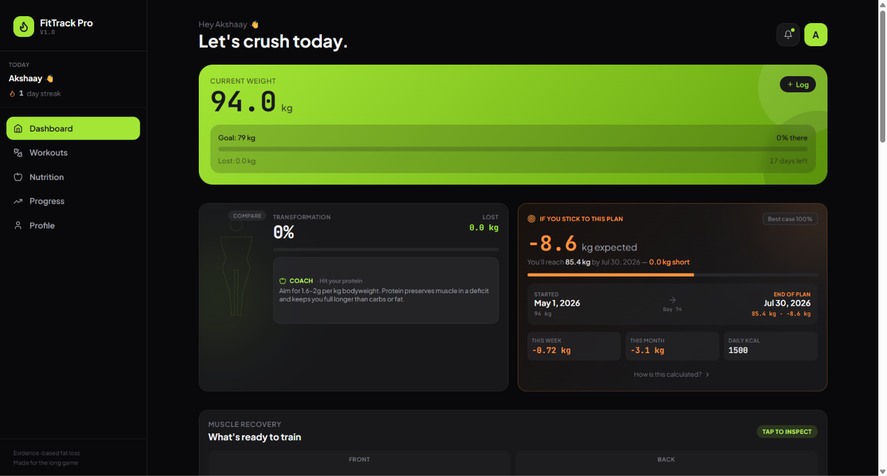
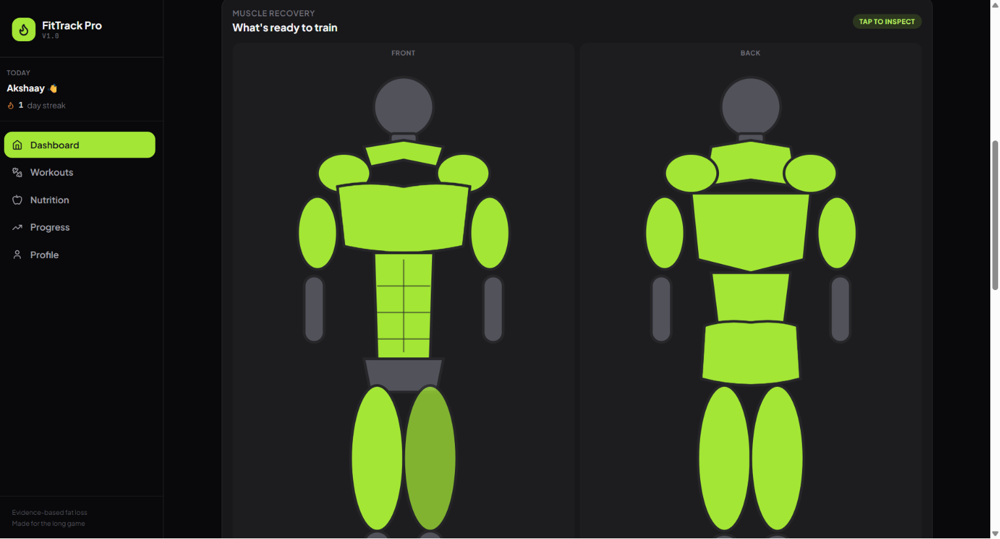
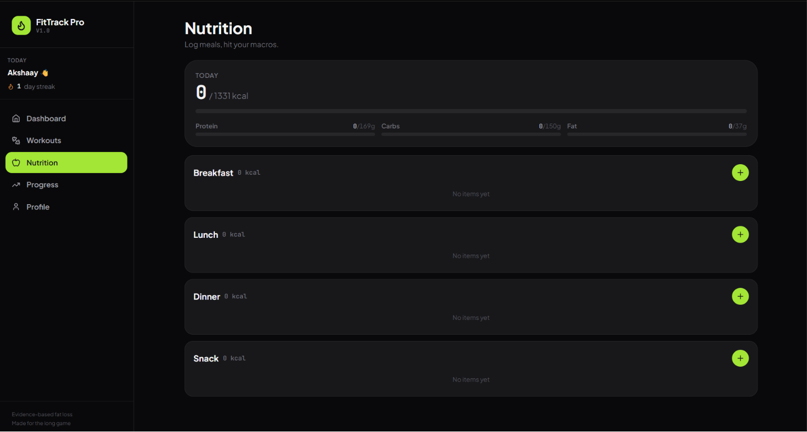
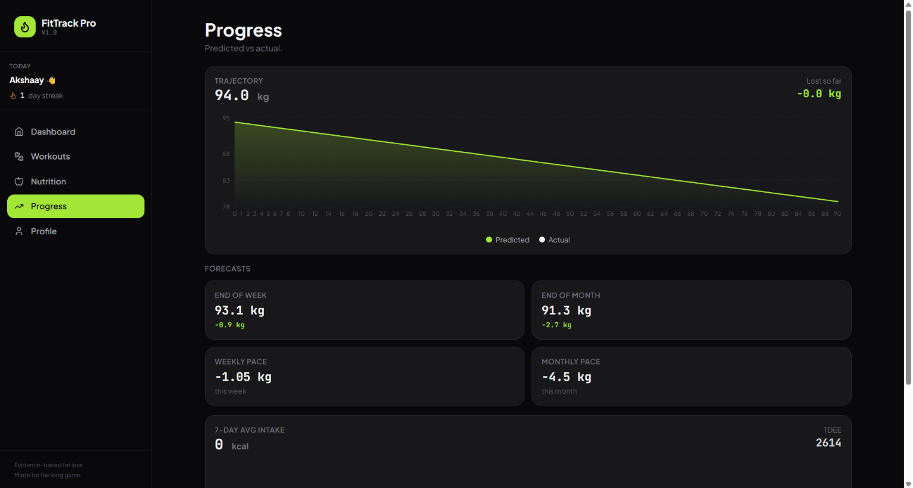
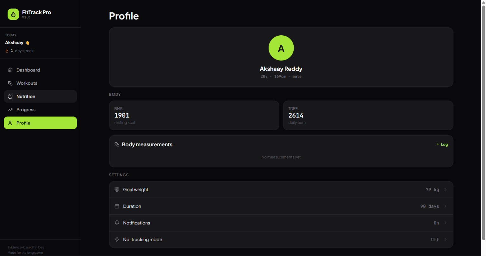

# 💪 FitTrack Pro

### A Cloud-Based Full Stack Fitness Tracking Platform

Track workouts • Monitor nutrition • Predict weight progress • Analyze muscle recovery • Stay consistent

🌐 **Live Demo:** https://freakyfitness.onrender.com/

[Live Demo](https://freakyfitness.onrender.com/) • [LinkedIn](https://www.linkedin.com/in/akshayreddy29005/) • [GitHub](https://github.com/Shaysurvives)

---

# 📖 Overview

FitTrack Pro is a modern cloud-based fitness management platform designed to help users achieve their health goals through intelligent workout planning, nutrition tracking, body analytics, and progress prediction.

The application provides an intuitive dashboard with real-time statistics, workout scheduling, calorie management, muscle recovery visualization, and predictive weight tracking while securely storing user data in the cloud.

---

# ✨ Features

### 📊 Dashboard
- Personalized fitness dashboard
- Current weight tracking
- Goal progress monitoring
- Daily calorie summary
- Transformation prediction
- Weekly & monthly statistics

### 🏋️ Workout Planner
- Push Pull Legs & Bro Split
- Weekly workout schedule
- Volume tracking
- Muscle group analysis
- Workout logging

### 🥗 Nutrition Tracker
- Meal logging
- Protein tracking
- Carbohydrate tracking
- Fat tracking
- Daily calorie management
- Water intake tracker

### 📈 Progress Analytics
- Weight prediction graph
- Weekly forecast
- Monthly forecast
- Actual vs Predicted progress
- TDEE & BMR calculations

### 💪 Recovery Monitor
- Muscle recovery visualization
- Front & Back muscle mapping
- Recovery status indicator
- Workout readiness

### 👤 User Profile
- Personal profile management
- Goal weight configuration
- Fitness duration
- Body measurements
- Notification settings

---

# 🛠 Tech Stack

## Frontend

- React.js
- JavaScript
- HTML5
- CSS3

## Backend

- Node.js
- Express.js

## Database

- PostgreSQL (Neon)

## Deployment

- Render

## Tools

- Git
- GitHub
- REST APIs

---

# 📸 Application Screenshots

## Dashboard

---

## Workout Planner

---

## Nutrition Tracking

---

## Progress Analytics

---

## Muscle Recovery

---

## User Profile

---

# 🚀 Live Application

https://freakyfitness.onrender.com/

---

# 💡 Skills Demonstrated

- Full Stack Development
- REST API Development
- React.js
- Node.js
- Express.js
- PostgreSQL
- Database Design
- CRUD Operations
- Cloud Deployment
- Authentication
- Responsive Web Design

---

# 🔮 Future Improvements

- AI Workout Recommendation Engine
- AI Nutrition Coach
- Exercise Video Library
- Social Fitness Community
- Wearable Device Integration
- Mobile Application
- Dark/Light Theme
- Push Notifications

---

# 👨‍💻 Author

**Akshay Reddy**

💼 LinkedIn: https://www.linkedin.com/in/akshayreddy29005/

💻 GitHub: https://github.com/Shaysurvives

🌐 Live Demo: https://freakyfitness.onrender.com/

---

